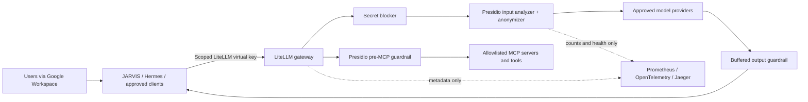

# AI Alchemy LiteLLM Guardrails and Self-Hosted Presidio Requirements

**Status:** Proposed implementation requirements  
**Date:** 2026-08-14  
**Primary repository:** `aialchemy-llm-gateway`  
**Runtime/deployment repository:** `core-infra`  
**Intended audience:** An implementation agent and the human reviewer approving deployment  

## 1. Authority and document boundary

This document defines the required outcome and acceptance evidence for adding privacy and content guardrails to the AI Alchemy LiteLLM gateway. It is an implementation specification, not evidence that the controls have already been implemented, installed, or legally certified.

Creating this document does **not** authorize deployment, credential changes, policy activation, service restarts, production traffic changes, or changes in the other repositories named below. An implementation agent must treat those as separate, explicitly approved work.

The words **MUST**, **MUST NOT**, **SHOULD**, **SHOULD NOT**, and **MAY** are normative.

## 2. Required outcome

The completed system MUST provide one organization-wide, self-hosted guardrail baseline for a small AI Alchemy deployment of approximately two to four users. It MUST protect traffic passing through LiteLLM before information is sent to external model providers, protect model output before it is returned to clients, and protect MCP tool arguments before a tool is called.

The minimum outcome is:

1. Self-hosted Presidio Analyzer and Anonymizer services run privately alongside LiteLLM.
2. A deterministic secret blocker rejects credentials and private-key material before provider or tool access.
3. Presidio masks supported Australian, Indian, and general personal identifiers before provider access.
4. A separate output control prevents unmoderated personal data from reaching a client, including on the OpenAI Responses API used by JARVIS/Hermes.
5. A separate MCP control checks tool arguments before every MCP call that traverses LiteLLM.
6. A global baseline is enabled by the gateway, not selected at the discretion of each client request.
7. No prompt, response, credential, detected value, or raw PII is added to LiteLLM, Presidio, Docker, OpenTelemetry, Jaeger, or Prometheus logs.
8. The implementation works without LiteLLM Enterprise-only team/key policy attachments.
9. JARVIS/Hermes is connected only after substantive end-to-end tests prove the controls on the actual endpoints and streaming modes it uses.

## 3. Decisions already made

These decisions are part of the required design and SHOULD NOT be reopened without recorded evidence:

| Topic | Decision |
|---|---|
| PII engine | Use self-hosted Presidio. Do not use Google Cloud Model Armor, Cloudflare DLP, Azure AI Content Safety, or another hosted DLP service for this phase. |
| Deployment shape | Run Presidio Analyzer and Anonymizer as separate private services. Do not embed them in the LiteLLM process. |
| Production policy source | Use reviewed, version-controlled declarative configuration. The LiteLLM UI MAY be used to inspect or test, but it is not the production source of truth. |
| Organization baseline | Apply one global baseline to all gateway traffic. Do not depend on Enterprise-only team/key policy attachments. |
| Australian template | Use `Advanced PII Protection (Australia)` only as reference material. It is not sufficient or safe to enable unchanged. |
| Indian coverage | Create and test an AI Alchemy India PII add-on containing Presidio's Indian recognizers. A new public upstream LiteLLM template is not required. |
| EU coverage | Treat GDPR and EU AI requirements as governance, minimisation, transparency, training, and human-oversight requirements. Do not represent them as a keyword-filter template. |
| NSFW template | Do not enable `NSFW Content Filter (Australia)` globally until its categories and false positives have been evaluated. Keyword matching alone is not a contextual safety system. |
| Competitor template | Keep `Competitor Mention Detection` disabled for the internal organization gateway. It is a brand-control feature, not a privacy or security control, and would obstruct legitimate research. |
| Observability | Retain the existing Prometheus and OpenTelemetry integration with privacy-safe metadata only. Observability MUST NOT be an enforcement dependency. |
| Vector stores | Vector stores are not required to deliver this guardrail phase. Any later RAG/vector-store project requires its own ingestion, authorization, retention, deletion, and PII controls. |

## 4. Verified current state

The following was verified locally on 2026-08-14 and MUST be rechecked by the implementation agent because repository and runtime state can change:

- The image repository pins `litellm[proxy]==1.95.0` and builds an otherwise unmodified LiteLLM proxy image.
- Runtime model and feature configuration is external to this repository and is mounted from `core-infra/llm-gateway-config.yml`.
- The running `ai-alchemy-litellm` container is healthy on image tag `v1.95.0`.
- No Presidio Analyzer or Anonymizer service is deployed.
- The authenticated gateway API reports zero configured guardrails and zero configured policies.
- The live template endpoint reports 16 templates, while the local backup in the pinned image contains 18. LiteLLM fetches templates from a mutable upstream `main` branch by default, so template discovery is not reproducible in the current deployment.
- Google Workspace SSO is configured for human UI access. API clients continue to authenticate with scoped LiteLLM virtual keys.
- `turn_off_message_logging: true`, `store_prompts_in_spend_logs: false`, and OpenTelemetry `message_logging: false` are configured and MUST be preserved.
- LiteLLM callbacks currently include OpenTelemetry and Prometheus.
- `store_model_in_db: true` is configured, but `supported_db_objects` contains only `mcp`; guardrails and policies are not currently declared as database-managed objects.
- MCP access is fail-closed by key with `require_key_mcp_access_defined: true`.

The production documentation in `core-infra` still contains older Microsoft Entra references in places even though the current Compose configuration uses Google SSO. Documentation correction is a required implementation deliverable.

## 5. Scope

### 5.1 In scope

- Text input sent to model providers through LiteLLM.
- Text output returned through LiteLLM.
- OpenAI Chat Completions, OpenAI Responses, and Anthropic Messages-compatible routes that are enabled in the gateway.
- Streaming and non-streaming behavior.
- MCP calls that are discovered and executed through LiteLLM.
- JARVIS/Open WebUI and Hermes traffic when they use the LiteLLM path.
- Australian, Indian, and general/global PII recognizers.
- Deterministic credential and secret detection.
- A cautious, test-driven content-safety baseline.
- Privacy-safe health, metrics, alerting, and operational runbooks.
- Failure handling, rollout, rollback, and evidence needed for production approval.

### 5.2 Out of scope for the first release

- Image, audio, video, OCR, and document-file redaction.
- A general-purpose malware scanner or data-classification platform.
- Automatic legal-compliance certification.
- Customer-facing brand or competitor suppression.
- Per-team and per-key policy differences that require a LiteLLM Enterprise licence.
- Vector database provisioning or document ingestion.
- Sending PII to a third-party guardrail service.
- Storing original-to-mask mappings or rehydrating masked PII in model output.
- Protecting a direct MCP connection that bypasses LiteLLM. Such a path must be removed, routed through LiteLLM, or protected separately before it is considered in scope.

## 6. Architecture and trust boundaries

Trust-boundary rules:

- External model providers, model-generated content, user content, and MCP tool arguments/results are untrusted.
- Presidio services MUST be reachable only from the private service network. They MUST NOT publish host ports or be reachable through the public tunnel.
- The LiteLLM master key MUST remain an administrative credential and MUST NOT be placed in JARVIS, Hermes, Prometheus, Presidio, test fixtures, browser storage, or client configuration.
- Each API client MUST use a scoped virtual key. Google SSO protects the human admin UI; it is not API authentication.
- A guardrail MUST NOT be able to weaken model authorization, MCP authorization, or tool allowlists. Guardrails supplement deterministic authentication and authorization.
- No client-supplied field may disable, remove, replace, or lower the global baseline.

## 7. Repository ownership and expected deliverables

### 7.1 `aialchemy-llm-gateway` responsibilities

This repository owns the LiteLLM image and image-level compatibility. An implementation agent MUST:

- Keep LiteLLM and all added dependencies pinned and reproducible.
- Confirm whether the pinned unmodified LiteLLM package fully supports the required Presidio behavior on every required endpoint.
- Add image smoke or compatibility tests if needed to catch removal or regression of Presidio hooks, policy parsing, Responses API handling, and guardrail imports.
- Extend CI path filters if new test/config paths must trigger validation.
- Continue signing images and producing provenance/SBOM evidence.
- Avoid adding Presidio Python packages to the LiteLLM image merely because Presidio is used. The Analyzer and Anonymizer are separate HTTP services.
- Only build a custom Presidio Analyzer derivative if the official pinned image cannot load required language models or recognizers from read-only mounted configuration. Any derivative image requires its own pinning, SBOM, signature, vulnerability scan, licence attribution, and multi-architecture decision.

### 7.2 `core-infra` responsibilities

The runtime deployment repository owns:

- Presidio Analyzer and Anonymizer Compose services.
- Private networks, health checks, resource limits, container security, restart policy, and log limits.
- Presidio recognizer and NLP configuration mounted read-only.
- LiteLLM environment variables pointing to the private Presidio services.
- The global guardrail/policy configuration in `llm-gateway-config.yml`.
- Privacy-safe Prometheus/OpenTelemetry configuration and alerts.
- End-to-end test scripts, production runbook, backup/export procedure, rollout, and rollback.
- Google SSO documentation and scoped-key operating procedures.

### 7.3 Client responsibilities

JARVIS/Open WebUI, Hermes, Athanor, and any other client owners MUST:

- Use the scoped gateway key intended for that client and no broader key.
- Use a LiteLLM-routed endpoint for protected inference.
- Preserve server-side user attribution where available without accepting a spoofable client identity as authorization truth.
- Not request ad hoc guardrail selection as a substitute for the global baseline.
- Not use a direct MCP fallback if that bypasses the required MCP guardrail.
- Handle a sanitized blocked-request response and a guardrail-unavailable response without repeatedly resubmitting sensitive content.

## 8. Self-hosted Presidio requirements

### PRES-001: Separate services

Deploy one Presidio Analyzer service and one Presidio Anonymizer service using the current official GitHub Container Registry packages. The implementation MUST select an explicit stable release tag and immutable digest. `latest`, a floating branch, and the legacy unmaintained Microsoft Container Registry images MUST NOT be used.

### PRES-002: Network isolation

- Both services MUST be attached to a dedicated internal Docker network shared with LiteLLM.
- Neither service may publish a host port.
- Neither service may attach to `gateway-edge` or a public ingress network.
- The services SHOULD have no internet egress after image pull and model/config provisioning.
- LiteLLM MUST refer to the services by private service DNS names through `PRESIDIO_ANALYZER_API_BASE` and `PRESIDIO_ANONYMIZER_API_BASE`.

### PRES-003: Container hardening

Each Presidio service MUST have:

- a read-only root filesystem where supported;
- a minimal writable `tmpfs`, mounted `noexec` where compatible;
- `no-new-privileges:true`;
- all Linux capabilities dropped;
- a non-root user where the selected official image supports it;
- an explicit health check using a documented endpoint or a harmless synthetic request;
- bounded CPU, memory, process count, and container-log rotation;
- graceful shutdown and a documented startup time for the NLP model;
- no secrets unless a specific, reviewed custom operator genuinely requires one.

Initial resource limits MUST be measured on the target Apple Silicon host. A reasonable starting envelope is 2 CPUs and 2 GiB for Analyzer and 0.5 CPU and 512 MiB for Anonymizer, but these are provisional limits, not acceptance evidence.

### PRES-004: Language support

- English (`en`) is the mandatory first-release NLP language.
- Australian and Indian structured identifiers MUST be tested even when embedded in otherwise English text.
- Hindi and other Indian-language free text MUST NOT be advertised as supported merely because Indian numeric identifiers work in English mode.
- Adding a language requires a pinned NLP model, version-controlled configuration, cold-start and resource measurement, and a dedicated accuracy corpus for that language.

### PRES-005: Recognizer configuration

- Prefer Presidio's maintained built-in recognizers.
- Any custom recognizer MUST live in version control, include its source/rationale, use context and checksum validation where feasible, and have positive, negative, boundary, Unicode, spacing, and hyphenation tests.
- Ad hoc recognizers supplied by arbitrary client requests MUST be disabled or rejected. Production recognizers are administrator-controlled configuration.
- Analyzer decision traces MUST NOT be enabled in production if they expose matched text.

### PRES-006: No reversible rehydration

`output_parse_pii` MUST remain false. Masked data MUST NOT be restored into the model response. No mapping from a placeholder to the original value may be persisted in logs, telemetry, a cache, or a database.

### PRES-007: Failure behavior

- A timeout, connection failure, malformed response, or internal error from either Presidio service MUST fail closed for a protected request.
- Input data MUST NOT be forwarded to the model provider after a guardrail failure.
- MCP arguments MUST NOT be forwarded to a tool after a guardrail failure.
- Output bytes MUST NOT be released after an output guardrail failure.
- The client error MUST be sanitized and distinguish policy rejection from temporary guardrail unavailability without revealing the detected value.
- Automatic retry MUST NOT create an unguarded path.

## 9. Required guardrail set

Guardrail names below are normative so tests and runbooks can refer to stable identifiers. An implementation MAY adjust a name only if every requirement, test, dashboard, and document is updated together.

### GR-001: `aialchemy-secrets-pre-v1`

Use LiteLLM's built-in content filter in `pre_call` mode for high-confidence secret patterns. It MUST use `BLOCK`, not `MASK`, for:

- API keys and bearer tokens;
- OAuth tokens and refresh tokens;
- private key blocks and signing keys;
- cloud access and secret keys;
- GitHub and Slack tokens;
- database URLs containing credentials;
- passwords in clearly labelled password/secret assignment syntax;
- additional organization-specific secret formats with reviewed tests.

The pattern set MUST include positive and negative tests for source code, documentation placeholders, environment-variable names, hashes, UUIDs, and ordinary high-entropy strings. A broad `generic_api_key` pattern MUST NOT be enabled until its false-positive rate is measured.

### GR-002: `aialchemy-pii-input-v1`

Use Presidio in `pre_call` mode with `presidio_filter_scope: input`, `output_parse_pii: false`, and an explicit `pii_entities_config` rather than an unreviewed “all entities” switch.

Minimum first-release entities and actions:

| Data class | Entities/examples | Default action | Notes |
|---|---|---|---|
| Indian government identifiers | `IN_AADHAAR`, `IN_PAN`, `IN_PASSPORT`, `IN_VOTER`, `IN_VEHICLE_REGISTRATION` | `MASK` | Must use built-in validation/context and synthetic tests. |
| Australian personal identifiers | `AU_TFN`, `AU_MEDICARE`, Australian passport through a verified built-in/custom pattern | `MASK` | Australian passport coverage must be proven; do not infer it from the template label. |
| Direct identity/contact | `PERSON`, `EMAIL_ADDRESS`, `PHONE_NUMBER`, `LOCATION` | `MASK` | Apply reviewed confidence thresholds to NER entities to manage false positives. |
| Financial identifiers | `CREDIT_CARD`, `IBAN_CODE` and supported bank-account identifiers relevant to enabled workflows | `MASK` | Valid checksums are required where supported. |
| Authentication secrets | Any token or credential missed by GR-001 | `BLOCK` | A Presidio custom recognizer MAY provide defence in depth; GR-001 remains primary. |
| Business identifiers | `AU_ABN`, `AU_ACN`, `IN_GSTIN` | Allow or monitor initially | These may be public business identifiers. Mask only when the approved data-classification policy treats the context as personal, such as a sole trader. |
| Network addresses | `IP_ADDRESS`, `MAC_ADDRESS` | Allow or monitor initially | Blanket masking would break technical support and code workflows. |
| Protected attributes | nationality, race, religion, political belief, disability, sexuality | Do not blanket-mask | These are context-sensitive and may be necessary for legitimate work. Protect them through purpose, access, minimisation, and approved-use policy rather than broad keyword removal. |

The implementation MUST record chosen confidence thresholds with test evidence. It MUST NOT describe Presidio as guaranteeing detection of all PII.

### GR-003: `aialchemy-pii-output-v1`

Use a separate Presidio output guardrail with `presidio_filter_scope: output` and `output_parse_pii: false`.

Requirements:

- Non-streaming output MUST be scanned before it is returned.
- For streaming output, **no unmoderated byte may be released**. The initial acceptable implementation is to buffer the complete output until it has passed the output guardrail, then return it through a client-compatible response. Disabling streaming for protected endpoints is also acceptable as a temporary, explicitly documented fallback.
- Chunk-by-chunk masking MUST NOT be accepted without a test proving detection across chunk boundaries and valid transformed output on the exact LiteLLM version and endpoint.
- In particular, a Chat Completions streaming test is not evidence that OpenAI Responses streaming is safe. `/v1/responses` needs its own test.
- If the pinned LiteLLM release cannot safely transform or buffer Responses streams, the agent MUST stop deployment and either pin a verified fixed upstream release or propose a minimal reviewed patch. It MUST NOT silently pass through streamed output.

### GR-004: `aialchemy-pii-mcp-v1`

Use Presidio in `pre_mcp_call` mode for every MCP call that traverses LiteLLM.

- Secret and restricted-identifier arguments MUST be blocked by default.
- Masking MAY be used only when the masked value still allows the specific tool to operate safely.
- A tool that legitimately requires a restricted identifier needs an explicit tool-specific exception, deterministic authorization, a documented business purpose, and, where appropriate, human confirmation. It MUST NOT receive a gateway-wide bypass.
- Existing key-to-MCP-server and key-to-tool allowlists MUST remain enforced.
- Tool results returned to a model MUST pass through the normal input PII guardrail before they leave the organization boundary.
- Tool results rendered directly to the user without another LiteLLM call are outside LiteLLM's output guardrail and require an equivalent client or MCP-layer control.

### GR-005: `aialchemy-content-safety-v1`

Content safety MUST be a separate control from PII protection. The first implementation MAY use LiteLLM's built-in content filter, but it MUST start in a non-enforcing test/shadow phase when possible.

Before enforcement, the policy owner MUST approve:

- the exact prohibited-use categories;
- whether each category is input-only, output-only, or both;
- the action and sanitized user message;
- support and escalation behavior for self-harm-related content;
- the treatment of child sexual abuse material and other unlawful content;
- the language coverage actually tested;
- documented legitimate-use exceptions for security, legal, research, health, and educational work.

The Australian NSFW template is only a test corpus seed. Its English/Australian keyword coverage is not sufficient for Indian languages, and keyword matching cannot distinguish harmful instructions from support, reporting, quoting, or analysis. High false-positive categories MUST remain disabled until a contextual control is selected and evaluated.

### GR-006: Competitor filter remains off

The `Competitor Mention Detection` template MUST NOT be attached to the global internal policy. If a future customer-facing product needs brand controls, it requires a separate product-level requirement, corpus, and approval.

## 10. India-specific policy requirement

An AI Alchemy India PII add-on MUST be created in version-controlled configuration. It is required because the current Australian templates do not cover the Indian identifier set.

The add-on MUST include at least:

- `IN_AADHAAR`;
- `IN_PAN`;
- `IN_PASSPORT`;
- `IN_VOTER`;
- `IN_VEHICLE_REGISTRATION`;
- `IN_GSTIN`, initially allowed/monitored or contextually masked because it is commonly a business identifier;
- Indian phone-number and postal-address fixtures using the general recognizers, with accuracy evidence;
- common formatting variations, Unicode digits where supported, spaces, hyphens, JSON escaping, and surrounding English context.

This add-on is an organization configuration, not a statement of compliance with India's Digital Personal Data Protection Act or Rules. Legal applicability and commencement must be reviewed separately.

## 11. Policy composition and attachment

### POL-001: Global baseline

Create one policy named `aialchemy-global-baseline-v1` and apply it with global scope (`scope: "*"`) if the pinned open-source LiteLLM build supports and enforces global policy attachments.

Required logical order:

1. `aialchemy-secrets-pre-v1`
2. `aialchemy-pii-input-v1`
3. approved input portion of `aialchemy-content-safety-v1`
4. provider/model call
5. `aialchemy-pii-output-v1`
6. approved output portion of `aialchemy-content-safety-v1`

MCP calls additionally require `aialchemy-pii-mcp-v1` immediately before tool execution.

Where the result of one transformation must be consumed by the next guardrail, use an ordered policy pipeline. A simple unordered/parallel `guardrails.add` list is not sufficient evidence of correct data flow.

### POL-002: Open-source fallback

Team/key policy attachments are documented as Enterprise-only and MUST NOT be a dependency. If global policy attachment or the ordered pipeline is unavailable or licence-gated in the pinned build:

- configure every mandatory guardrail as administrator-controlled `default_on: true` where supported;
- prove that it runs for all required endpoints, models, streaming modes, and scoped keys;
- implement ordering in a small, reviewed LiteLLM custom guardrail only if declarative open-source configuration cannot provide it;
- stop and request approval before maintaining a fork or accepting a wider patch.

The final implementation MUST include a licence-free test run. A UI badge or ability to save configuration is not sufficient proof.

### POL-003: Clients cannot opt out

- Omitting a `guardrails` request field MUST still apply the global baseline.
- Supplying an empty, unknown, or alternative `guardrails` field MUST NOT remove the baseline.
- A client must not be able to choose lower confidence thresholds, pass ad hoc recognizers, select `logging_only`, set `output_parse_pii`, or change actions.
- Requests made with every production virtual-key type MUST receive the same baseline.

### POL-004: Applied-policy evidence

Acceptance tests SHOULD assert LiteLLM's `x-litellm-applied-policies`, `x-litellm-applied-guardrails`, and policy-source response headers when available. Headers MUST contain only stable names and sources, never detected content.

## 12. Configuration source and template reproducibility

- Production guardrails, entity actions, thresholds, policies, and attachments MUST be version-controlled in `core-infra/llm-gateway-config.yml` or read-only files referenced by it.
- The UI MAY be used for exploration and testing, but an unexported UI edit MUST NOT become production state.
- Set `LITELLM_LOCAL_POLICY_TEMPLATES=true` so browsing templates does not fetch mutable content from the upstream GitHub `main` branch.
- Production enforcement MUST NOT depend on the template endpoint. A template is scaffolding, not an active policy.
- The implementation SHOULD leave guardrails/policies out of `supported_db_objects` unless database-managed editing is explicitly approved.
- If UI/database management is later approved, add the relevant object types, document precedence against YAML, export the objects into version control, back up Postgres, test restoration, and prove policies survive recreation and restart.
- Every policy change MUST have a version bump or reviewed change record, test evidence, and rollback instructions.

## 13. Endpoint and protocol coverage

The global baseline MUST be proven on every endpoint actually enabled for clients:

| Interface | Non-streaming | Streaming | Tool continuation | Required |
|---|---:|---:|---:|---:|
| `/v1/responses` | Yes | Yes | Yes | P0 because JARVIS/Hermes uses Responses-compatible routing |
| `/v1/chat/completions` | Yes | Yes | Yes | P0 |
| `/v1/messages` | Yes | Yes | Yes | P0 for Claude/Athanor routes that traverse this gateway |
| LiteLLM MCP gateway | N/A | As supported | Yes | P0 |

For each interface, visibility or HTTP 200 is not sufficient. Tests MUST prove semantic continuation, guardrail application, upstream redaction, and safe failures.

## 14. Identity and access requirements

- Google Workspace SSO remains the human LiteLLM UI identity provider.
- API traffic MUST continue using scoped LiteLLM virtual keys.
- JARVIS/Hermes MUST NOT use the LiteLLM master key.
- Existing Claude subscription OAuth header separation MUST be preserved: the scoped gateway key and provider OAuth token must not be confused or logged.
- User attribution SHOULD be added from a trusted server-side JARVIS/Hermes session when available. A user identifier supplied directly by an untrusted API client MUST NOT grant access or weaken policy.
- Only gateway administrators may change guardrail configuration.
- A break-glass bypass, if the owner later requires one, MUST be admin-only, time-limited, explicitly activated, separately logged without content, and disabled by default. It is not required for the first release.

## 15. Logging, metrics, and telemetry

### LOG-001: Content minimisation

Preserve and test:

- LiteLLM `turn_off_message_logging: true`;
- `store_prompts_in_spend_logs: false`;
- OpenTelemetry `message_logging: false`;
- API-key redaction;
- no Presidio decision trace containing matched text;
- no Docker debug logging in production.

Logs and errors MUST NOT contain request bodies, response bodies, tool arguments/results, Authorization headers, virtual keys, provider credentials, raw matched values, before/after text, or reversible mask mappings.

### LOG-002: Minimal useful telemetry

Prometheus/OpenTelemetry MAY capture:

- request count and duration;
- guardrail invocation count and duration;
- pass, mask, block, error, and timeout counts;
- entity type and action as bounded labels, but never the entity value;
- Presidio health, restart count, memory, and CPU;
- endpoint family and stable model alias;
- policy and guardrail version names.

User text, free-form error messages, user email, document names, tool arguments, and high-cardinality identifiers MUST NOT be metric labels or span attributes.

Prometheus, OpenTelemetry, and Jaeger MUST NOT be required for enforcement. If they are unavailable, guardrails continue to enforce. If Presidio is unavailable, protected traffic fails closed and an alert fires.

### LOG-003: Retention

Operational metadata retention MUST have an approved purpose and duration. The implementation MUST reconcile Australian deletion/de-identification principles, GDPR storage limitation where applicable, and any applicable Indian statutory log-retention duty with legal advice. It MUST NOT solve a metadata retention obligation by retaining raw prompts or raw PII.

## 16. Organizational policy and legal-control overlay

Technical filtering is only one control. Before organization-wide activation, the owner MUST approve a short acceptable-use and data-handling policy with these classes:

| Class | Example | Gateway rule |
|---|---|---|
| Public | Published marketing copy, public documentation | Allowed subject to normal safety controls |
| Internal | Internal plans and routine non-sensitive operations | Allowed to approved models and tools |
| Confidential | Customer context, contracts, non-public business data | Minimise; use only for an approved purpose and approved provider/tool |
| Restricted | Credentials, private keys, government identifiers, highly sensitive health/financial data | Secrets blocked; identifiers masked; tool use requires an explicitly approved workflow |

The organizational policy MUST also cover:

- approved purposes and prohibited uses;
- data minimisation before submission;
- approved model providers and data-processing terms;
- cross-border transfer review where applicable;
- retention and deletion;
- incident and breach response;
- access/request contact for individuals where applicable;
- human review for consequential decisions;
- AI limitations, hallucination risk, and user training;
- periodic review of false positives, misses, providers, models, tools, and recognizers.

Legal mapping for review, not automatic certification:

- Australian APP 11 calls for reasonable technical and organizational steps to protect personal information and to destroy or de-identify it when no longer needed.
- GDPR principles include purpose limitation, data minimisation, storage limitation, integrity/confidentiality, and accountability.
- India's DPDP Rules 2025 list security measures including encryption, obfuscation, masking or virtual tokens, access control, logs/monitoring, continuity, processor contracts, and organizational measures; commencement is phased under the official notification.
- EU AI requirements may add AI-literacy and human-oversight duties depending on role, system, use, and territorial reach.

The implementation review MUST state which regimes actually apply to AI Alchemy and obtain legal advice where the answer affects retention, notice, consent, breach response, or provider terms.

## 17. Test strategy and acceptance evidence

### TEST-001: Synthetic data only

- Automated and manual guardrail tests MUST use generated synthetic values, never real customer, staff, or credential data.
- Identifier generators MUST produce clearly marked test fixtures and, where required, valid checksums without copying a real person's identifier.
- Test credentials MUST be inert and scoped to a disposable local mock if a realistic format is required.
- Captured mock-provider payloads MUST be deleted after the test run.

### TEST-002: Entity corpus

The corpus MUST include positive and negative cases for:

- every entity/action in the production configuration;
- Australian TFN, Medicare, passport, ABN, and ACN handling;
- Indian Aadhaar, PAN, passport, voter ID, vehicle registration, and GSTIN handling;
- name, email, phone, address/location, credit card, IBAN, IP, and MAC behavior;
- API keys, OAuth/bearer tokens, private keys, cloud keys, database URLs, and generic high-entropy strings;
- spaces, hyphens, punctuation, mixed case, Unicode, JSON, Markdown, source code, tool arguments, tool results, long prompts, and identifiers split across streaming chunks;
- discussion of religion, race, disability, gender, self-harm support, competitor comparisons, security research, and sample code to measure false positives.

### TEST-003: Upstream non-disclosure proof

Use a local mock/echo provider or transport capture under test control. For each mandatory entity:

1. Send a synthetic request through the real LiteLLM endpoint.
2. Assert the required policy and guardrails were applied.
3. Assert the provider received only the masked form or received no request for `BLOCK` actions.
4. Assert the client received no raw restricted value.
5. Search LiteLLM, Presidio, Docker, OpenTelemetry, Jaeger, Prometheus, and test-harness output for the synthetic sentinel and assert zero matches.

An HTTP status, model-list entry, or guardrail-list entry is not evidence of this requirement.

### TEST-004: Protocol matrix

Run TEST-003 through:

- Chat Completions, streaming and non-streaming;
- Responses, streaming and non-streaming;
- Anthropic Messages, streaming and non-streaming, when enabled;
- a tool call followed by a tool result and model continuation;
- MCP discovery and a read-only MCP tool call;
- every provider adapter class in use, including subscription-backed routes where applicable.

### TEST-005: Failure tests

Prove fail-closed behavior for:

- Analyzer stopped, unhealthy, slow, and returning malformed JSON;
- Anonymizer stopped, unhealthy, slow, and returning malformed JSON;
- LiteLLM restart during a request;
- Presidio restart and cold model load;
- observability stack unavailable;
- provider unavailable after successful input masking;
- client cancellation;
- output guardrail rejection after the provider has responded;
- streaming data with an entity split across chunks;
- unknown or empty client `guardrails` value;
- policy and container restart/recreation persistence.

### TEST-006: Accuracy thresholds

Minimum release gates:

- 100% detection/blocking of the curated high-confidence secret fixtures;
- 100% detection of checksum-valid structured government-ID fixtures included in the approved corpus;
- at least 95% precision and 95% recall on the approved synthetic NER/contact corpus, or explicit owner acceptance of every documented exception;
- zero raw synthetic sentinels in provider captures for protected input;
- zero raw synthetic sentinels in client output for protected output;
- zero raw synthetic sentinels in logs, spans, metrics, and stored spend records;
- no client-controlled bypass of the baseline.

These thresholds measure the tested corpus only and MUST NOT be described as a guarantee for arbitrary real-world text.

### TEST-007: Performance and capacity

Measure guardrail-only latency separately from model latency on the target machine.

Initial performance goals:

- healthy/ready within 60 seconds after an ordinary restart with models already present locally;
- input guardrail added p95 latency no more than 300 ms for an English request up to 10 KiB at one concurrent request;
- input guardrail added p95 latency no more than 500 ms at eight concurrent requests;
- no crash, unbounded queue, or resource-limit breach during a 30-minute mixed test;
- output buffering latency and loss of token-by-token display explicitly reported to the reviewer.

If these provisional goals are not realistic with the selected model, report measurements and propose a revised budget. Do not reduce recognizers or fail-open behavior solely to meet latency.

### TEST-008: Build and configuration validation

At minimum:

- validate YAML and JSON syntax;
- run `docker compose config` with presence-only test secrets;
- verify every image uses a tag and digest;
- verify signatures/provenance where the upstream publishes them, and record when unavailable;
- scan images and custom configuration for vulnerabilities and secret-shaped content;
- run both architecture build/smoke checks if this repository's image changes;
- test the exact digest intended for production, not a locally floating tag;
- re-run all existing gateway, SSO, scoped-key, model, MCP, backup, and restore tests to detect regressions.

## 18. Content-safety evaluation gate

Before `aialchemy-content-safety-v1` blocks production requests, produce a short evaluation report containing:

- the exact template/version or rules evaluated;
- positive and negative corpora for Australian English, Indian English, and any other claimed language;
- per-category precision, recall, and false-positive examples;
- treatment of quoted, analytical, educational, legal, security, and support contexts;
- user-facing rejection messages and escalation path;
- a decision for each category: enforce, monitor, or disable;
- reviewer and approval date.

Until this report is approved, only deterministic secret blocking and PII protection may be enforced. The content-safety control remains in test/shadow mode or disabled.

## 19. Rollout plan

### Phase 0: Baseline and freeze

- Fetch current branches and record exact commits, image digests, running configuration, enabled routes, keys by alias only, MCP registrations, and existing health/tests.
- Confirm current Google SSO behavior and correct stale Entra documentation.
- Back up LiteLLM Postgres and run the existing restore test before changing database-managed behavior.

### Phase 1: Isolated Presidio validation

- Deploy Analyzer and Anonymizer on the private network without attaching them to live policy.
- Run health, security, resource, accuracy, and log-leak tests with synthetic data.
- No production request is routed to the new services yet.

### Phase 2: Gateway test route

- Add declarative guardrails and global-policy configuration in a non-production or test route.
- Prove all endpoint, streaming, provider-capture, MCP, failure, and restart tests.
- Confirm no Enterprise licence is required for the selected global enforcement path.

### Phase 3: JARVIS/Hermes canary

- Use a dedicated scoped canary key and one approved user/workflow.
- Verify semantic response, read-only file/tool use, tool continuation, cancellation, streaming behavior, correct model attribution/billing, and safe errors.
- Review latency, block/mask counts, false positives, and log redaction without examining raw content.

### Phase 4: Organization-wide activation

- Attach the approved global baseline to all requests.
- Keep competitor filtering disabled.
- Enable only the content-safety categories approved by the evaluation gate.
- Monitor health and aggregate outcomes closely for the first week, with daily false-positive review based on user-reported examples that are sanitized before storage.

## 20. Rollback and incident behavior

- Rollback MUST be a version-controlled revert to the last known-good Compose/config/image digest followed by the normal validation suite.
- Rollback MUST NOT create an unguarded production path. If safe guardrail operation cannot be restored, affected routes are unavailable until the owner explicitly accepts another containment measure.
- Never delete volumes or policy data as part of routine rollback.
- Preserve a redacted incident timeline and configuration hashes, not raw prompts.
- A suspected PII disclosure requires key/token exposure assessment, provider-side retention/deletion review, affected system identification, and the applicable breach-response process.
- Only the human owner may authorize emergency bypass or resumption after a fail-closed outage.

## 21. Expected implementation work packages

### WP1: Deployment foundation (`core-infra`)

- Add pinned/digest Presidio services, internal network, hardening, health checks, limits, and LiteLLM service dependencies.
- Add read-only Presidio NLP/recognizer configuration.
- Add private endpoint environment variables to LiteLLM.
- Add privacy-safe health metrics and alerts.

### WP2: Gateway policy (`core-infra`)

- Add the four mandatory guardrails and the evaluated content-safety guardrail.
- Add the India PII add-on and threshold/action manifest.
- Add global policy/pipeline or the proven open-source `default_on` fallback.
- Pin local template browsing and keep production independent of template fetching.

### WP3: Compatibility and image validation (`aialchemy-llm-gateway`)

- Prove the pinned LiteLLM version supports every required endpoint/mode.
- Add regression smoke tests and CI triggers where necessary.
- Pin a fixed upstream release or propose a minimal patch if Responses streaming cannot be safely moderated.
- Publish and verify a signed, SBOM-attested image only if this repository changes.

### WP4: Test harness and evidence (`core-infra`, with client repositories as needed)

- Add synthetic fixture generators and the endpoint/provider/MCP/failure matrix.
- Add a local mock provider that proves upstream redaction.
- Add sentinel leak searches for all logs and telemetry.
- Produce a redacted acceptance report with commands, versions, results, and unresolved risks.

### WP5: Client canary and documentation

- Validate JARVIS/Hermes through the actual Responses path and scoped keys.
- Remove or separately protect any direct MCP bypass.
- Update gateway architecture, production, operations, service-contract, backup, incident, and rollback documentation.
- Document the acceptable-use/data-classification policy and user guidance.

These work packages may be implemented separately, but production activation depends on all P0 acceptance gates.

## 22. Definition of done

The project is complete only when all of the following are true:

- [ ] Presidio Analyzer and Anonymizer run as pinned, private, hardened, healthy services.
- [ ] Mandatory guardrails exist in version-controlled configuration.
- [ ] The India identifier add-on is present and tested.
- [ ] The Australian template has been reviewed and tailored rather than enabled unchanged.
- [ ] The global baseline applies without an Enterprise licence and cannot be disabled by clients.
- [ ] Secrets are blocked before providers and MCP tools.
- [ ] PII is masked before providers and protected before client output.
- [ ] `/v1/responses` streaming releases no unmoderated data.
- [ ] MCP tool arguments and provider-bound tool results are protected.
- [ ] Real JARVIS/Hermes semantic and tool-continuation tests pass.
- [ ] Every required provider/endpoint/streaming combination passes the synthetic upstream non-disclosure test.
- [ ] Presidio outages fail closed; observability outages do not disable enforcement.
- [ ] No raw synthetic sentinel appears in logs, traces, metrics, or spend records.
- [ ] Performance and resource results meet the approved budget.
- [ ] Content-safety categories have an approved evaluation report before enforcement.
- [ ] Competitor filtering remains off for the internal gateway.
- [ ] Existing Google SSO, scoped-key, model routing, subscription routing, budget, MCP, backup, and restore behavior has not regressed.
- [ ] Runbook, acceptable-use policy, incident path, and rollback are approved.
- [ ] The reviewer has the exact commits and image digests tested.

## 23. Implementation stop conditions

The implementation agent MUST stop and ask for human direction if:

- safe Responses streaming requires a maintained LiteLLM fork or broad patch;
- a mandatory global enforcement mechanism is Enterprise-only in the exact pinned build;
- a requested language lacks an approved local NLP model or accuracy corpus;
- a tool needs raw restricted PII and no narrow authorization design exists;
- tests find raw PII or credentials in logs/telemetry/provider payloads;
- the only available failure behavior is fail-open;
- enabling the controls would break direct Claude subscription OAuth header separation;
- production activation, restart, key change, or external publication has not been explicitly approved.

## 24. Glossary

- **Provider guardrail:** In LiteLLM, a guardrail integration/engine such as Presidio or the built-in content filter. It does not mean the LLM provider itself protects the request.
- **Policy template:** Scaffolding that can create guardrail and policy definitions. It is not active enforcement until reviewed, saved, attached/defaulted, and tested.
- **Mask:** Replace a detected value with a non-reversible placeholder before it crosses a trust boundary.
- **Block:** Reject the request or output without forwarding/releasing it.
- **Fail closed:** Deny the protected operation when the guardrail cannot make a trustworthy decision.
- **MCP:** Model Context Protocol; in this deployment, a path to registered tools whose arguments need authorization and PII checks.
- **PII:** Personally identifiable/personal information. Exact legal definitions vary by jurisdiction.

## 25. Authoritative implementation references

- [LiteLLM policy templates](https://docs.litellm.ai/docs/proxy/guardrails/policy_templates)
- [LiteLLM Presidio PII/PHI masking](https://docs.litellm.ai/docs/proxy/guardrails/pii_masking_v2)
- [LiteLLM built-in content filter](https://docs.litellm.ai/docs/proxy/guardrails/litellm_content_filter)
- [LiteLLM guardrail policies](https://docs.litellm.ai/docs/proxy/guardrails/guardrail_policies)
- [LiteLLM policy flow builder](https://docs.litellm.ai/docs/proxy/guardrails/policy_flow_builder)
- [Presidio installation and current container registry](https://data-privacy-stack.github.io/presidio/installation/)
- [Presidio supported entities](https://microsoft.github.io/presidio/supported_entities/)
- [Presidio project scope and detection limitations](https://microsoft.github.io/presidio/)
- [OAIC APP 11 security of personal information](https://www.oaic.gov.au/privacy/australian-privacy-principles/australian-privacy-principles-guidelines/chapter-11-app-11-security-of-personal-information)
- [European Commission GDPR processing principles](https://commission.europa.eu/law/law-topic/data-protection/information-business-and-organisations/principles-gdpr_en)
- [India Digital Personal Data Protection Rules 2025](https://www.meity.gov.in/static/uploads/2025/11/53450e6e5dc0bfa85ebd78686cadad39.pdf)
- [India DPDP Act commencement notification](https://www.meity.gov.in/static/uploads/2025/11/c56ceae6c383460ca69577428d36828b.pdf)
- [European Commission AI literacy guidance](https://digital-strategy.ec.europa.eu/en/faqs/ai-literacy-questions-answers)

